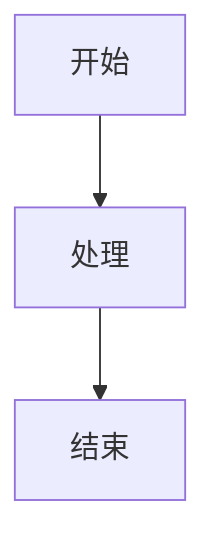
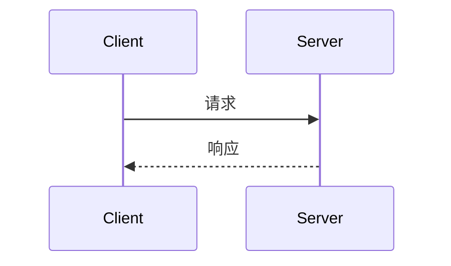

# <标题>

> **文档状态**: 草稿 / 评审中 / 已确认  
> **作者**: <作者>  
> **日期**: <日期>

---

## 1. 背景说明

<!-- 描述与本次设计相关的技术和业务背景，帮助读者理解"为什么会有这个设计" -->

## 2. 目标阐述

<!-- 明确要解决的问题或新增的功能 -->

- 
- 

**非目标（Out of Scope）**：

- 

---

## 3. 方案设计

<!-- 概述整体设计思路。复杂流程用 Mermaid 图辅助说明 -->

<!-- 示例：流程图

-->

<!-- 示例：时序图

-->

---

## 4. 设计说明

### 4.1 功能设计

<!-- 描述具体处理流程或工作逻辑，不需要代码细节 -->

### 4.2 接口设计（可选）

<!-- 仅当涉及 API 新增或变更时填写 -->

#### `METHOD /path`

**请求**

| 字段 | 类型 | 必填 | 说明 |
|------|------|------|------|
|      |      |      |      |

**响应**

| 字段 | 类型 | 说明 |
|------|------|------|
|      |      |      |

### 4.3 数据库设计（可选）

<!-- 仅当涉及表结构变更时填写 -->

#### 表：`table_name`

| 字段 | 类型 | 说明 |
|------|------|------|
|      |      |      |

**变更说明**：

---

## 5. 关键点说明

<!-- 列举实现要点与特别注意事项 -->

- 
- 
