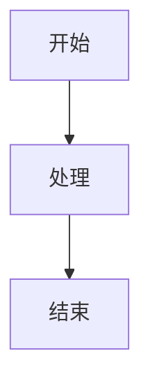
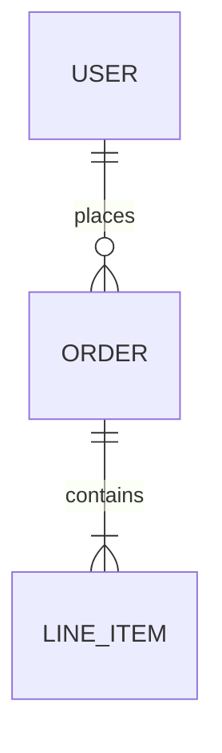
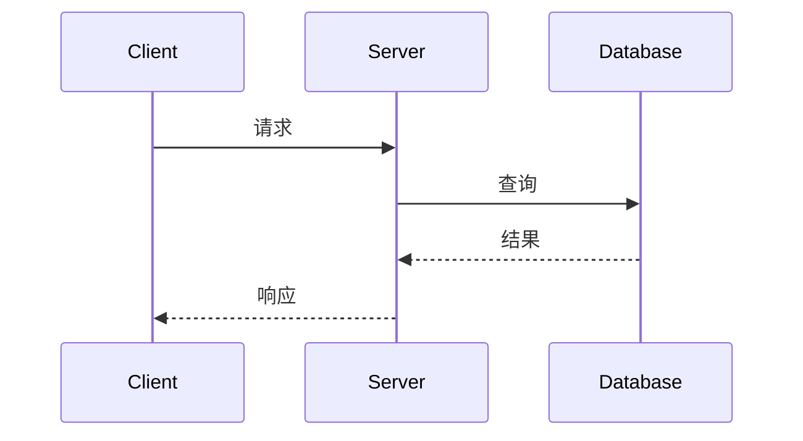

# <标题>

> **文档状态**: 草稿 / 评审中 / 已确认  
> **作者**: <作者>  
> **日期**: <日期>  
> **读者对象**: <谁需要读这篇文档，例如：后端团队 / 评审人 / 跨团队接入方>

---

## TL;DR

<!-- 三句话讲清：要解决什么问题、决定怎么做、影响谁。让读者 30 秒内决定要不要细读。总字数控制在 150 词以内 -->

- **问题**：<1 sentence describing the pain point>
- **方案**：<1 sentence describing the chosen approach>
- **影响**：<1 sentence describing impact scope>

---

## 1. 背景说明

<!-- 当前状态 + 痛点（2-3 sentences, max 5 lines），为什么现在做（1-2 sentences）。不要包含实现细节 -->

**当前痛点**：

**为什么现在做**：

---

## 2. 目标与范围

### 目标
<!-- 从源文档复制 Goals，保持 bullet list 格式 -->
- 
- 

### 主要用户/角色
<!-- 如果源文档有 Primary Users，复制到这里 -->
- 

### 非目标
<!-- 从源文档复制 Non-Goals，保持 bullet list 格式 -->
- 
- 

---

## 3. 关键发现

<!-- 仅当源文档包含 Discovery 或 Key Discoveries 章节时才包含此部分。使用 bullet points，最多两级嵌套，简洁列出发现，不展开解释 -->

- 
- 

---

## 4. 设计决策

<!-- 仅当源文档包含 Scope Decisions 章节时才包含此部分。记录关键设计边界和决策点 -->

| 决策点 | 选择 | 理由 |
|--------|------|------|
|        |      |      |

---

## 5. 方案设计

### 5.1 整体架构

<!-- 使用 Mermaid 图展示架构（flowchart）或交互流程（sequenceDiagram），控制在 8-10 个节点/5 个参与者以内 -->

<!-- 2-3 sentences 解释图表关键点，max 5 lines -->

### 5.2 核心组件

| 组件 | 职责 | 依赖 |
|------|------|------|
|      |      |      |

### 5.3 方案对比

<!-- 仅当源文档明确讨论了备选方案时才包含此章节。绝不臆造源文档中不存在的备选方案 -->

| 方案 | 优点 | 缺点 | 是否采用 |
|------|------|------|----------|
| 方案 A |  |  | ✅ |
| 方案 B |  |  | ❌ |

**选择理由**：<2-3 sentences from source Decision & Rationale>

---

## 6. 设计说明

### 6.1 数据模型

<!-- 仅当源文档包含数据库设计时才包含此小节。使用 Mermaid erDiagram 或表格展示关键实体 -->

**设计要点**：
- <关键索引>
- <关键约束>

详见 design.md §X Database Design 的完整 DDL 和字段定义。

### 6.2 接口设计

<!-- 仅当源文档包含 API 规格时才包含此小节。使用表格列出接口清单 -->

| 接口 | 方法 | 用途 | 关键参数 |
|------|------|------|----------|
|      |      |      |          |

**错误处理策略**：

| HTTP Status | 类别 | 重试策略 |
|-------------|------|----------|
| 4xx | 参数/鉴权错误 | 不重试 |
| 429 | 限流 | 退避重试 |
| 503 | 依赖不可用 | 原 cursor 重试 |

详见 design.md §X API Design 的完整请求/响应契约和错误码表。

### 6.3 关键流程

<!-- 选择 1-2 个最重要的流程，使用 Mermaid sequenceDiagram 展示，控制在 5 个参与者以内 -->

#### <流程名称>

<2-3 sentences 强调流程关键点，max 5 lines>

详见 design.md §X Data Flow 的完整边界处理逻辑和所有场景。

### 6.4 配置项

<!-- 仅当源文档包含 Configuration 章节时才包含此小节。总结配置策略，不列举所有参数 -->

支持配置的关键参数：
- <参数类别 1>：<简要说明>
- <参数类别 2>：<简要说明>

详见 design.md §X Configuration 的完整配置项和默认值。

---

## 7. 测试策略

<!-- 仅当源文档包含 Testing 章节时才包含此部分。总结测试分类，不列举详细用例 -->

测试覆盖范围：
- **<测试类别 1>**：<简要说明覆盖内容>
- **<测试类别 2>**：<简要说明覆盖内容>

详见 design.md §X Testing 的完整测试用例。

---

## 8. 影响范围与风险

**影响模块/团队**：
- <模块/服务名称>
- <团队名称>

**关键风险与缓解措施**：

| 风险 | 可能性 | 影响 | 缓解措施 |
|------|--------|------|----------|
|      |        |      |          |

**回滚方案**：<如果源文档提到，简要说明>

---

## 9. 关键点说明

<!-- 列举 3-5 个实现时必须注意的关键约束，每条 1 行，聚焦"会让实现者感到意外"的点 -->

- 
- 
- 

---

## 10. 待讨论问题

<!-- 可选章节，仅当源文档包含开放问题时才包含 -->

- 
- 

---

## 参考文档

- **详细设计规范**: [design.md](path/to/design.md) — 完整的实现规范，供 AI Agent 编码和工程师实现时参考
  - 包含：完整 API 契约、数据库 DDL、配置参数、错误码表、测试用例、边界处理逻辑
- **相关文档**: <如果有其他相关文档，在这里列出>
