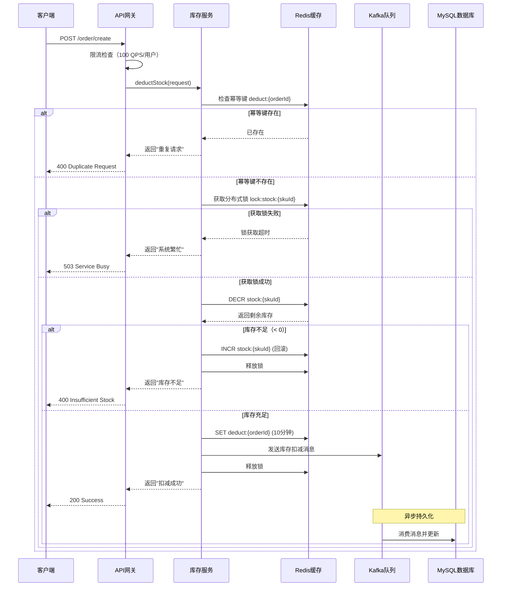

# 高质量概要设计（HLD）编写指南

**文档版本**: 1.0  
**目标受众**: 技术文档编写者、架构师、技术审查者  
**应用场景**: 将详细设计转换为概要设计的参考标准

---

## 1. HLD 与 LLD 的本质区别

理解两者的差异是写好 HLD 的前提。

| 维度 | 概要设计（HLD） | 详细设计（LLD） |
|------|----------------|----------------|
| **关注点** | 系统整体架构、模块划分、技术选型、核心链路 | 单个模块的内部实现逻辑、算法、数据结构、接口定义 |
| **核心读者** | 架构师、技术经理、跨团队协作方、运维团队 | 开发工程师、测试工程师、Code Reviewer、AI Agent |
| **详细程度** | 宏观视角，关注"做什么"和"为什么这样做" | 微观视角，关注"怎么做"和"具体实现细节" |
| **核心交付物** | 架构拓扑图、技术栈清单、核心流程图、容量规划 | 类图/接口定义、状态机、核心算法伪代码/代码、异常处理策略 |
| **技术决策边界** | 框架选型、中间件选型、系统分层、服务边界划分 | 数据结构选择、算法复杂度、并发控制策略、异常降级方案 |

**关键区别**：HLD 告诉读者"为什么这样设计"，LLD 告诉读者"如何精确实现"。

---

## 2. HLD 结构化模板骨架

```markdown
# [系统名称] 概要设计文档

## 1. 背景与目标
- 业务背景：解决什么业务问题
- 核心目标：性能指标（QPS/TPS）、可用性要求（SLA）、扩展性预期

## 2. 系统边界与约束
- 功能边界：明确做什么、不做什么
- 非功能约束：性能要求、安全要求、合规要求
- 依赖系统清单：上下游系统及其SLA保障

## 3. 整体架构设计
- 系统分层：展示层、应用层、数据层、基础设施层
- 核心模块划分：各模块职责与交互关系
- 架构拓扑图：使用C4模型或分层架构图

## 4. 技术选型与决策
- 框架选型：Spring Boot/Go-Micro 等，及选型理由
- 中间件选型：Redis/Kafka/MySQL 等，及容量预估
- 技术风险评估：技术债务、学习成本、运维复杂度

## 5. 核心流程设计
- 关键业务流程：正常流程 + 异常流程
- 时序图：核心交互链路
- 状态机：关键状态流转

## 6. 高可用与容灾设计
- 限流降级策略
- 容灾切换方案
- 数据一致性保障

## 7. 监控与运维
- 核心监控指标
- 日志规范
- 告警阈值
```

**各章节核心目标**：
- 第1-2节：对齐业务与技术边界，防止需求蔓延
- 第3-4节：建立架构共识，为后续开发定下技术基调
- 第5节：明确核心链路，识别技术难点与风险点
- 第6-7节：保障系统生产可用性，降低运维成本

---

## 3. HLD 内容深度与规范

### 3.1 空泛描述 vs 具体规范

这是区分"优秀 HLD"和"流水账"的关键标准。

| 类型 | 示例 |
|------|------|
| ❌ **空洞描述** | "做好异常处理，防止系统崩溃。" |
| ✅ **具体规范** | "必须显式捕获 Redis 客户端连接超时异常（TimeoutException），并在 50ms 内降级为读取本地 JVM 缓存，同时上报监控告警。" |
| ❌ **空洞描述** | "系统采用高可用架构确保稳定性。" |
| ✅ **具体规范** | "采用 Redis 主从 + 哨兵模式，主节点故障时 30s 内自动切换；降级策略为读本地缓存，保证 99.9% 可用性。" |
| ❌ **空洞描述** | "通过分布式锁防止并发问题。" |
| ✅ **具体规范** | "使用 Redisson 实现 SKU 级别分布式锁（key: `lock:stock:{skuId}`），超时时间 3s，防止并发扣减导致超卖。" |

**规范要点**：
- 明确技术选型（Redis、Redisson、JVM 缓存）
- 明确量化指标（50ms、30s、99.9%、3s）
- 明确触发条件（连接超时、主节点故障）
- 明确具体行为（降级、切换、上报告警）

### 3.2 场景示例：高并发电商减库存系统

**场景描述**：用户下单时，系统需要先在 Redis 中预扣减库存，再异步写入 MySQL 实现最终一致性。需要处理超卖、并发冲突、数据一致性问题。

#### HLD 应包含的内容

**系统分层**：
- **接口层**：接收下单请求，参数校验
- **应用层**：库存预扣减逻辑、分布式锁控制
- **数据层**：Redis（热数据）+ MySQL（持久化）
- **基础设施层**：消息队列（异步同步）

**技术选型**：
- **Redis**：作为库存预扣减的高性能缓存，支持原子操作（DECR）
  - 选型理由：QPS 支持 10w+，满足秒杀场景
  - 容量预估：1000 SKU × 1KB = 1MB，预留 10 倍冗余
- **分布式锁**：基于 Redisson 实现，防止并发扣减导致超卖
  - 锁粒度：SKU 级别（key: `lock:stock:{skuId}`）
  - 超时时间：3 秒（防止死锁）
- **消息队列**：Kafka，异步同步 Redis → MySQL
  - 保障最终一致性，削峰填谷

**高并发考量**：
- 限流：网关层按用户 ID 限流（100 QPS/用户）
- 降级：Redis 不可用时，直接返回"系统繁忙"，保护 MySQL

**高可用考量**：
- Redis 主从 + 哨兵模式
- MySQL 主从 + 读写分离
- 消息队列消费失败重试 3 次，超时进入死信队列

#### HLD 不应包含的内容

❌ 完整的接口定义（方法签名、参数类型、返回值结构）  
❌ 详细的算法实现代码或伪代码  
❌ 完整的数据库表结构（DDL 语句）  
❌ 详细的异常处理代码逻辑  
❌ 幂等键的具体编码格式和过期时间计算  

这些属于 LLD 的范畴，在 HLD 中只需说明"采用幂等机制防重"即可。

### 3.3 优秀 HLD 的衡量标准

| 维度 | 具体标准 |
|------|---------|
| **逻辑一致性** | 技术选型能对应到架构图中的组件；风险识别能对应到高可用设计 |
| **可审查性** | 架构师能在 30 分钟内理解核心决策；技术经理能评估工作量和风险 |
| **可扩展性** | 明确扩展点（如新增库存来源、新增扣减规则） |
| **实际参考价值** | 评审时能回答"为什么这样设计"；上线后能快速定位架构缺陷 |

---

## 4. 可视化标准

### 4.1 图表使用场景

| 图类型 | 使用场景 | 核心价值 | HLD 中的典型用途 |
|--------|---------|---------|----------------|
| **架构拓扑图** | 系统整体架构 | 展示系统分层、模块边界、外部依赖 | 必须包含 |
| **时序图** | 核心流程 | 明确调用顺序、时间约束、异常路径 | 1-2 个关键流程 |
| **状态机图** | 状态流转逻辑 | 阐明状态转换条件 | 可选（如订单状态、库存状态） |
| **类图** | 领域模型设计 | 展示实体关系 | 不包含（属于 LLD） |
| **ER图** | 数据库设计 | 明确表结构、关系 | 简化版（只展示关键表和关系） |

### 4.2 何时不画图

- 简单的 CRUD 接口列表 → 用表格
- 单向依赖关系（A调用B） → 文字描述即可
- 状态只有2-3个 → 用文字或表格

### 4.3 图表质量标准

- **节点/参与者数量控制**：flowchart 8-10 节点，sequenceDiagram 5 参与者
- **配文说明**：每个图配 2-3 句解释（说明关键点，不复述图内容）
- **关注核心路径**：错误路径和边界情况不放图中，用文字或引用 LLD 说明

### 4.4 Mermaid 时序图示例：库存扣减核心流程



**说明要点**：
- 覆盖了幂等检查、锁获取、库存扣减、异步持久化等核心步骤
- 展示了 3 种异常路径（重复请求、锁超时、库存不足）
- 简化了 Kafka 重试逻辑，详细策略参考 LLD

---

## 5. 深度思考的体现

优秀的 HLD 必须体现对以下 3 类问题的深度思考。

### 5.1 性能瓶颈

**数据库死锁风险**：
- **场景**：高并发下，两个事务同时更新库存表和订单表，可能发生循环等待
- **HLD 应说明**：
  - 统一锁顺序：先锁库存表，再锁订单表
  - 降低锁粒度：使用乐观锁（version 字段）替代行锁
  - （详细的死锁分析和代码实现属于 LLD）

**Redis 热点 Key 问题**：
- **场景**：秒杀商品的库存 Key 被大量请求访问，单个 Redis 节点 CPU 打满
- **HLD 应说明**：
  - 本地缓存：JVM 内缓存库存快照，每 100ms 刷新一次
  - 分片策略：将库存拆分为 10 份，随机读取
  - 监控指标：Redis `commandstats`，QPS 超过 5w 触发告警

### 5.2 安全隐患

**防刷机制**：
- **风险**：恶意用户通过脚本高频下单，占用库存资源
- **HLD 应说明**：
  - 设备指纹：限制单设备 10 分钟内最多下单 5 次
  - 行为分析：识别异常下单模式（如固定时间间隔）
  - 验证码：高峰时段强制人机验证

**数据越权风险**：
- **风险**：用户 A 通过修改 `userId` 参数，扣减用户 B 的库存额度
- **HLD 应说明**：
  - Token 校验：从 JWT Token 中提取 `userId`，忽略请求参数
  - 权限校验：验证用户是否有权操作该 SKU

### 5.3 工程边界

**第三方依赖超时**：
- **场景**：调用支付网关接口时，网络抖动导致超时
- **HLD 应说明**：
  - 超时时间：HTTP 连接超时 1s，读取超时 3s
  - 重试策略：失败后立即重试 1 次，如仍失败则返回"支付处理中"
  - 幂等保障：支付网关接口必须支持幂等
  - 降级方案：支付网关不可用时，订单进入"待支付"状态

**依赖服务 SLA 不达标**：
- **场景**：上游用户服务承诺 SLA 99.9%，但实际经常超时
- **HLD 应说明**：
  - 缓存策略：本地缓存用户基础信息（TTL 5分钟）
  - 降级策略：用户服务超时（500ms）时，使用缓存数据
  - 监控告警：超时率超过 5% 触发告警

---

## 6. HLD 自查清单

使用以下清单验证 HLD 的完整性和质量。

- [ ] **【边界】明确系统功能边界与非功能约束，防止需求蔓延**
- [ ] **【选型】说明技术选型理由及容量预估，避免盲目跟风**
- [ ] **【流程】绘制核心业务流程时序图，覆盖正常与异常路径**
- [ ] **【风险】识别性能瓶颈、安全隐患、依赖风险，并提供应对方案**
- [ ] **【可视化】每个主要章节包含至少 1 个图表或表格**
- [ ] **【具体性】避免空洞描述，提供量化指标和具体策略**
- [ ] **【层次】未包含 LLD 层面的实现细节（代码、算法、接口签名）**
- [ ] **【引用】对于实现细节，明确引用 LLD 文档章节**

---

## 7. 转换思维

从 LLD 转换为 HLD 时，关键是"换一个视角讲故事"：

**LLD 视角**（给 AI Agent 和实现工程师）：
- "怎么写代码"（精确到每个字段、每种错误）
- "这个字段类型是 Long，默认值是 0，非空"
- "发生 TimeoutException 时执行第 47-52 行的降级逻辑"

**HLD 视角**（给架构师和审查者）：
- "为什么这样设计"（决策理由、核心思路、关键约束）
- "使用 Redis 存储热数据，满足 10w+ QPS 需求"
- "依赖服务超时时降级为本地缓存，保证 99.9% 可用性"

**转换时问自己**：如果我是审查者，我需要什么信息来判断这个设计是否合理？

---

**本指南专注于 HLD 的编写标准，用于指导从详细设计（LLD）到概要设计（HLD）的转换工作。**
