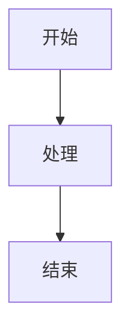
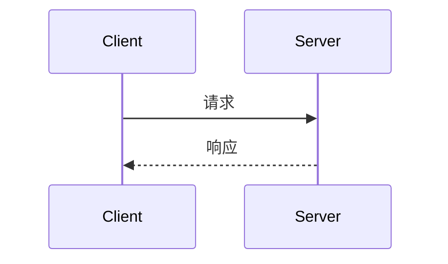

# <标题>

> **文档状态**: 草稿 / 评审中 / 已确认  
> **作者**: <作者>  
> **日期**: <日期>  
> **读者对象**: <谁需要读这篇文档，例如：后端团队 / 评审人 / 跨团队接入方>

---

## TL;DR

<!-- 三句话讲清：要解决什么问题、决定怎么做、影响谁。让读者 30 秒内决定要不要细读 -->

- **问题**：
- **方案**：
- **影响**：

---

## 1. 背景说明

<!-- 假设读者零背景。按「现状 → 痛点 → 动机」展开，帮读者理解"为什么会有这个设计" -->

**现状**：

**痛点**：

**为什么现在做**：

## 2. 目标阐述

<!-- 明确要解决的问题或新增的功能 -->

- 
- 

**非目标（Out of Scope）**：

<!-- 明确划出边界，防止后续误解 -->

- 

---

## 3. 关键发现（可选）

<!-- 如果源文档包含 Discovery 或 Key Discoveries 章节，保留在此处。列出调研阶段发现的关键技术事实、限制或约束 -->

---

## 4. 设计决策（可选）

<!-- 如果源文档包含 Scope Decisions 章节，保留在此处。记录重要的设计边界和决策点及其理由 -->

---

## 5. 方案设计

<!-- 先给整体思路，让评审者能先评估方向再看细节。复杂流程用 Mermaid 图辅助 -->

### 5.1 整体思路

<!-- 选对图：架构关系用 flowchart、调用时序用 sequenceDiagram、状态流转用 stateDiagram、数据模型用 erDiagram -->

<!-- 示例：流程图

-->

<!-- 示例：时序图

-->

### 5.2 方案对比（可选）

<!-- 仅当源文档讨论了备选方案时才包含此章节。列出源文档中实际考虑过的备选方案，给出选择理由。不要臆造源文档中不存在的备选方案 -->

| 方案 | 优点 | 缺点 | 是否采用 |
|------|------|------|----------|
| 方案 A（采用） |  |  | ✅ |
| 方案 B |  |  | ❌ 原因： |

---

## 6. 设计说明

### 6.1 功能设计

<!-- 描述具体处理流程或工作逻辑，到开发者能据此实现的粒度，但不需要代码细节 -->

**场景走查**（推荐）：

<!-- 用一条端到端的真实场景串起流程，比抽象逻辑更易懂。例如："用户点击提交 → 系统校验 X → 写入 Y → 返回 Z" -->

### 6.2 接口设计（可选）

<!-- 仅当源文档包含 API 规格时才填写。保持源文档中的所有字段名、类型、默认值不变 -->

#### `METHOD /path`

**请求**

| 字段 | 类型 | 必填 | 说明 |
|------|------|------|------|
|      |      |      |      |

**响应**

| 字段 | 类型 | 说明 |
|------|------|------|
|      |      |      |

**示例**：

<!-- 给一组真实的请求/响应样例，接入方无需读代码即可集成 -->

```json
```

### 6.3 数据库设计（可选）

<!-- 仅当源文档包含表结构变更时才填写。保留源文档中的所有 DDL、字段类型、索引定义和设计依据 -->

#### 表：`table_name`

| 字段 | 类型 | 说明 |
|------|------|------|
|      |      |      |

**变更说明**：

### 6.4 内部接口契约（可选）

<!-- 如果源文档包含 Internal API Contracts 章节，保留在此处。记录服务间内部接口的详细契约 -->

### 6.5 数据流（可选）

<!-- 如果源文档包含 Data Flow 章节，保留在此处。详细描述各个场景下的数据流转过程 -->

### 6.6 配置项（可选）

<!-- 如果源文档包含 Configuration 或 Constants 章节，保留在此处。记录所有配置项和默认值 -->

---

## 7. 错误处理（可选）

<!-- 如果源文档包含 Error Handling 章节，保留在此处。记录所有错误场景和处理策略 -->

---

## 8. 测试策略（可选）

<!-- 如果源文档包含 Testing 章节，保留在此处。记录测试计划和测试用例 -->

---

## 9. 影响范围与风险

<!-- 这改动会动到谁、有哪些风险、如何回滚 -->

- **影响模块/团队**：
- **风险与缓解**：
- **回滚方案**：

## 10. 关键点说明

<!-- 列举实现要点与特别注意事项——那些看代码会感到意外的约束或决策 -->

- 
- 

## 11. 待讨论 / 开放问题（可选）

<!-- 尚未定论、需要评审时拍板的问题 -->

- 

## 术语表（可选）

<!-- 文档中出现的非通用术语，给读者扫盲 -->

| 术语 | 含义 |
|------|------|
|      |      |
